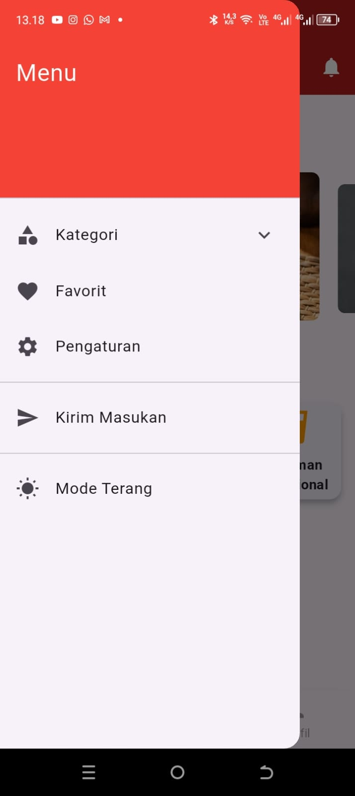
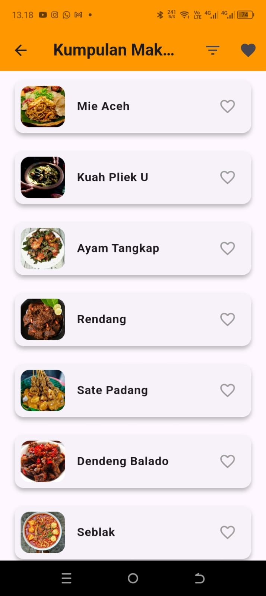

# Campus Semester's Project

A new Flutter project (just Frontend).

Aplikasi Resep Nusantara adalah platform yang dirancang untuk memperkenalkan dan mempermudah akses ke berbagai resep masakan khas Indonesia. Aplikasi ini bertujuan untuk melestarikan kekayaan kuliner Nusantara dengan menyediakan panduan memasak yang mudah dipahami.

## Fitur Utama
- **Katalog Resep**: Menampilkan berbagai resep masakan Indonesia yang lengkap dengan bahan dan langkah-langkah.
- **Pencarian Resep**: Pengguna dapat mencari resep berdasarkan nama masakan atau bahan utama.
- **Favorit**: Simpan resep favorit Anda untuk akses cepat di kemudian hari.
- **Interaktif**: Tersedia fitur komentar dan rating untuk setiap resep.

## Teknologi yang Digunakan
- **Frontend**: Flutter untuk antarmuka pengguna yang modern dan responsif.
- **Backend**: Firebase untuk autentikasi pengguna dan penyimpanan data resep.
- **Database**: Cloud Firestore untuk pengelolaan data secara real-time.

## Instalasi
1. **Clone Repository**
   ```bash
   git clone https://github.com/username/resep-nusantara.git
   ```
2. **Install Dependencies**
   ```bash
   flutter pub get
   ```
3. **Konfigurasi Firebase**
   - Tambahkan file `google-services.json` (untuk Android) dan `GoogleService-Info.plist` (untuk iOS) ke proyek Anda.
   - Ikuti panduan integrasi Firebase di [dokumentasi Firebase](https://firebase.google.com/docs/flutter/setup).

4. **Jalankan Aplikasi**
   ```bash
   flutter run
   ```

5. **Application View**
   - Logo Icon

     
     
   - Login

     
     
   - Landing Page (Light Mode)

     
     
   - Landing Page (Dark Mode)

     
     
   - Favorit Page

     
     
   - Profile Page

     
     
   - Side Menu

     
     
   - Food Menu

     
     
   - Drink Menu

     
     
   - Snack Menu

     
     

## Kontribusi
Proyek ini dikembangkan oleh:

- **Mochamed Fadhlan Tuhairi** (GitHub: [skrulleps](https://github.com/skrulleps)) - Main Dev.
- **Zidane Fauzan Saputra** (GitHub: [zidanefzns](https://github.com/zidanefzns)) - Feature Dev.
- **Irsyadul Asyrof** (GitHub: [irsydlasyrf](https://github.com/irsydlasyrf)) - Feature Dev.

Kami membuka kesempatan bagi siapa saja yang ingin berkontribusi. Silakan buat pull request atau hubungi kami untuk diskusi lebih lanjut.

## Dokumentasi
Untuk informasi lebih lanjut tentang pengembangan Flutter, lihat [dokumentasi Flutter online](https://docs.flutter.dev/).
